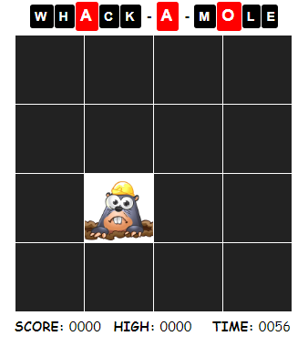

vue-whackamole
================

This project was bootstrapped with [Vue CLI](https://cli.vuejs.org/).

## Objective
This is my second [Vue.Js](https://vuejs.org/) project so far as I continue my study.<br>
I wanted to make a more challenging application to practice.

## Description


This is an app like the Whac-A-Mole arcade game.

* The speed changes as the game progresses.
* The number of moles appearing also increases.
* A sound will play if the user successfully hit a mole.

## Project setup
```
npm install
```

### Compiles and hot-reloads for development
```
npm run serve
```

### Compiles and minifies for production
```
npm run build
```

### Lints and fixes files
```
npm run lint
```

### Customize configuration
See [Configuration Reference](https://cli.vuejs.org/config/).
